<div align="center">

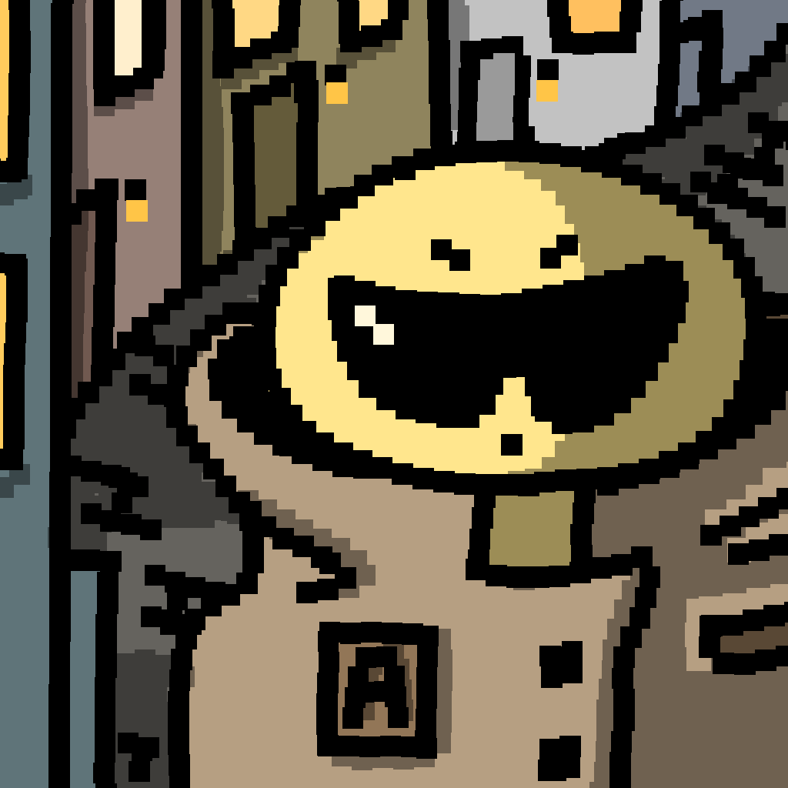

# Agentville

**A desktop dashboard for visually managing AI CLI agents — Claude Code, Codex, Gemini, and more**

<sub>Electron · React · TypeScript · English / 简体中文</sub>

<sub><b>English</b> · <a href="README.zh.md">简体中文</a></sub>

<!-- Cover: main window, default theme -->
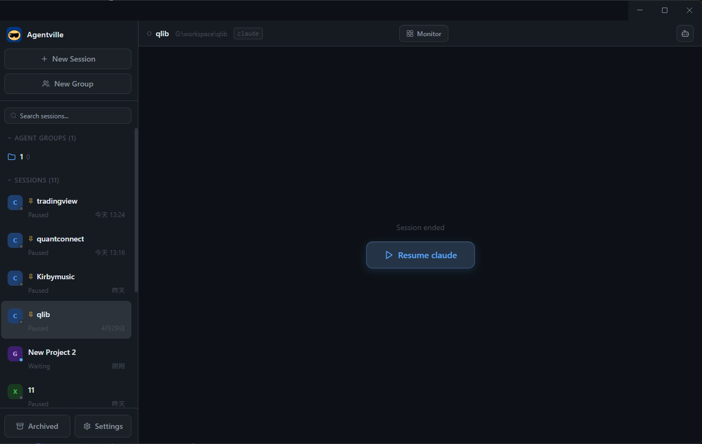

</div>

---

## Download

**Just want to use it?** Grab the installer — no Node.js or build setup required:

### [⬇ Download the latest Windows installer](https://github.com/lict1212/agentville/releases/latest)

Open the [latest release](https://github.com/lict1212/agentville/releases/latest), download `Agentville-Setup-x.x.x.exe`, and double-click to install. It's not code-signed yet, so Windows SmartScreen may warn "unknown publisher" — click **More info → Run anyway**.

> macOS builds aren't published yet — for now, run from source (see [Getting started](#getting-started)).

---

## Why this exists

AI CLI tools (Claude Code, Codex, Gemini, Aider) are great on their own, but the moment you juggle 2–3 projects at once it gets painful:

- One terminal window per project, switching by alt-tab, easy to get lost
- Every restart means manually `cd`-ing, re-explaining the project, pasting recent progress
- Want to compare how different models tackle the same task? You end up eyeballing three terminals
- Completion status is only visible if you're staring at the screen

Agentville pulls all of this into one window: manage multiple agent sessions like chat threads, with memory auto-loaded, status surfaced in real time, and MCP / Skills / Rules configured visually.

---

## Features

### Multi-session management

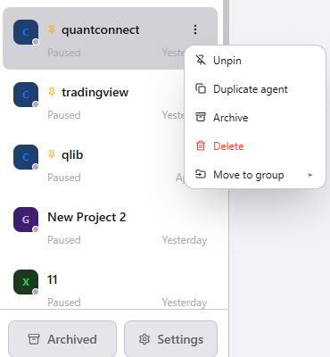

- Left-hand session list with live status dots (working / waiting / needs confirmation / paused)
- Per-session 3-dot menu: pin / duplicate agent / archive / delete / move to group
- CLI avatars (color-coded by Claude / Codex / Gemini / Aider)
- Search, archive, rename, delete
- Sound + red badge alerts when a background session finishes or needs confirmation
- Agent groups: collect related sessions into a group, collapse / expand to manage

### Monitor grid

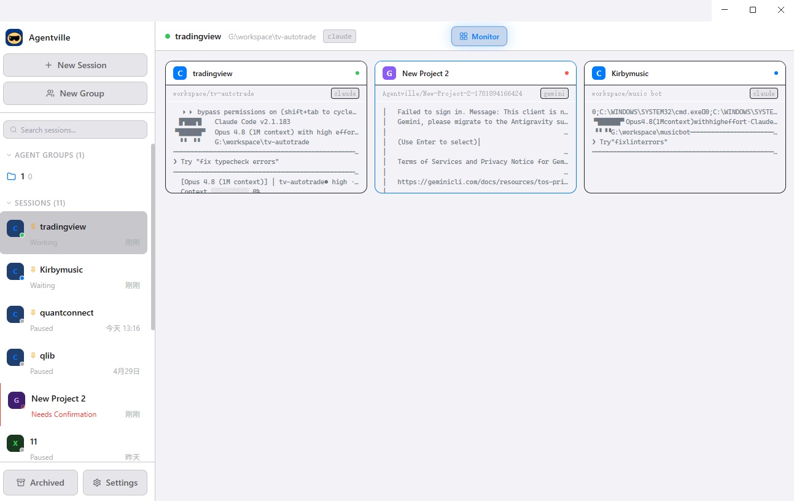

One click in the toolbar switches to a grid view: every running session previewed side by side (last terminal lines + status + CLI tag), click a card to jump in. A group is packed into a single card you can expand to see its members.

Status lights on the session cards and in the sidebar tell each agent's state at a glance:

- 🟢 **Green** — working (the agent is running)
- 🔵 **Blue** — waiting (idle, waiting for your input)
- 🔴 **Red** — needs confirmation (waiting for you to confirm; pulses to grab attention)
- ⚪ **Gray** — paused

### Quick session switcher (Ctrl+Tab)

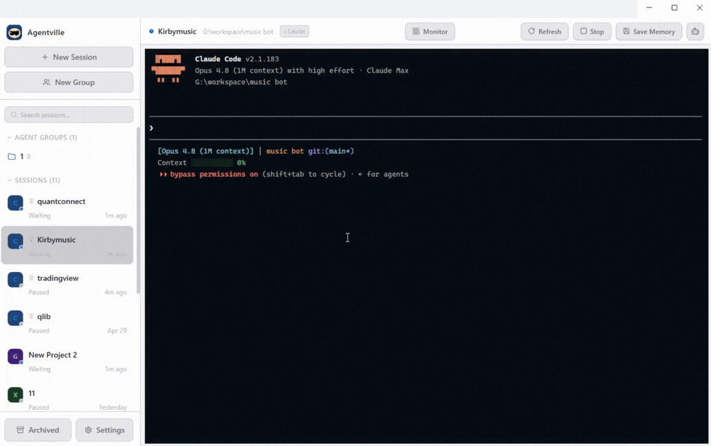

A VSCode-style overlay switcher: hold `Ctrl` to summon it, navigate with `Tab` / `Shift+Tab`, `Ctrl+scroll`, or mouse hover, release `Ctrl` to confirm or `Esc` to cancel. The list contains only running sessions, ordered by most recently used (MRU).

### Role / Memory / Rules (per session)

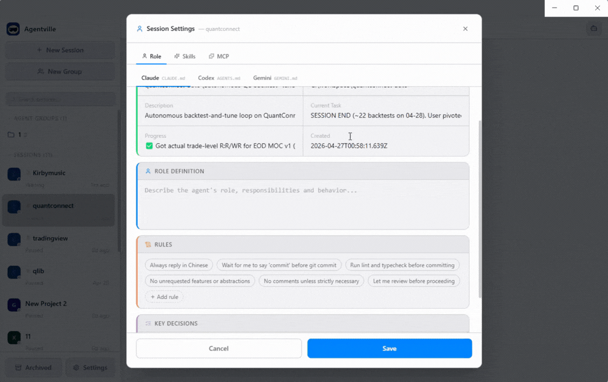

- **Role tab**: structured editing of `CLAUDE.md` / `AGENTS.md` / `GEMINI.md` — workstation status, role definition, key decisions, and rules in separate sections
- **Skills tab**: Claude Skills available to the current session (`<project>/.claude/skills/`), with one-click preset templates
- **MCP tab**: MCP servers scoped to the current session (`<project>/.mcp.json`)

**Rules chips**: rules are clickable tags — preset rules + a global custom library + any orphan rules already present in the file — so you can see at a glance which are enabled.

### Memory system

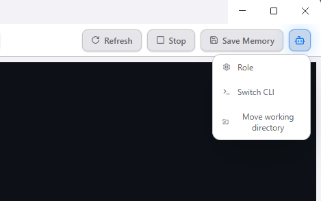

Each session has a top-right toolbar: Refresh / Stop / Save Memory, plus Role (settings) / Switch CLI / Move working directory.

Each session keeps two memory files:

- `CLAUDE.md` (or `AGENTS.md` / `GEMINI.md`) — current status, role, key decisions
- `memory.md` — a session history log, one summary line appended each time it stops

Clicking "Save Memory" manually, or auto-save (every 5 minutes while idle), triggers `AGENTVILLE_SAVE MM-DD`; the CLI reads the instructions, saves, and replies `SAVED`. Claude Code additionally uses a Stop hook to detect completion precisely.

### Duplicate agent

The "Duplicate agent" item in a session's 3-dot menu clones its role config in one step: it copies `CLAUDE.md` (role / rules / skills) + `.mcp.json` into a new working directory, resets memory to empty, and leaves the copy paused (it does not auto-start). Handy for spinning up several parallel instances on the same role setup.

### Global defaults

- **Default rules library**: new sessions automatically write the checked rules into CLAUDE.md
- **Global Skills**: user-level skills under `~/.claude/skills/`
- **Global MCP**: user-level MCP servers in `~/.claude.json`
- **Notifications**: completion-sound / confirmation-sound pickers + volume + OS toast toggle
- **Language**: instant switch between English and 简体中文

### 5 themes

Driven by CSS variables, applied instantly, with the Windows title-bar color kept in sync:

| Default | Slate | Light |
|:-:|:-:|:-:|
|  | 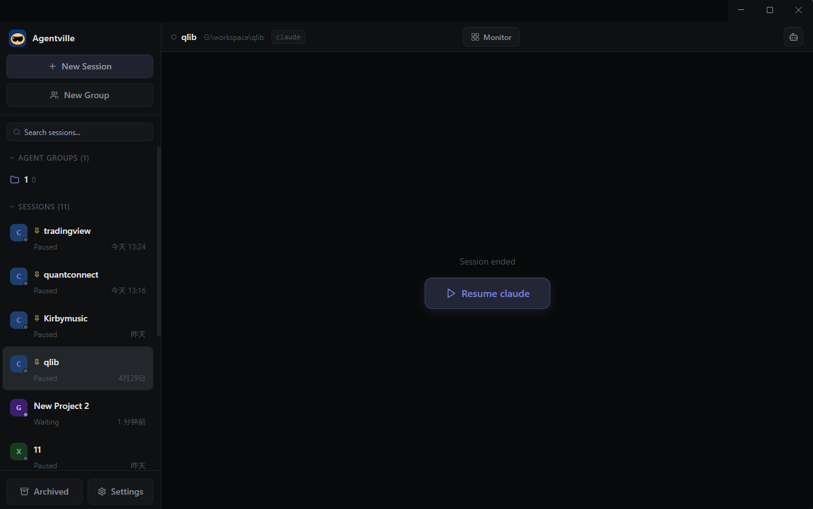 | 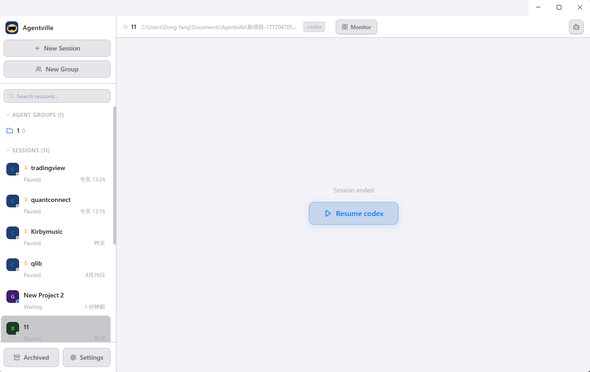 |

| Warm Sand | Strawberry Milk |
|:-:|:-:|
| 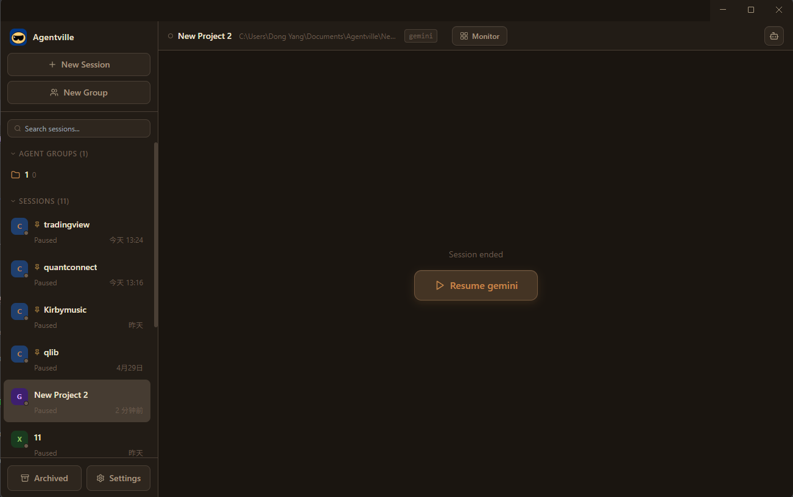 | 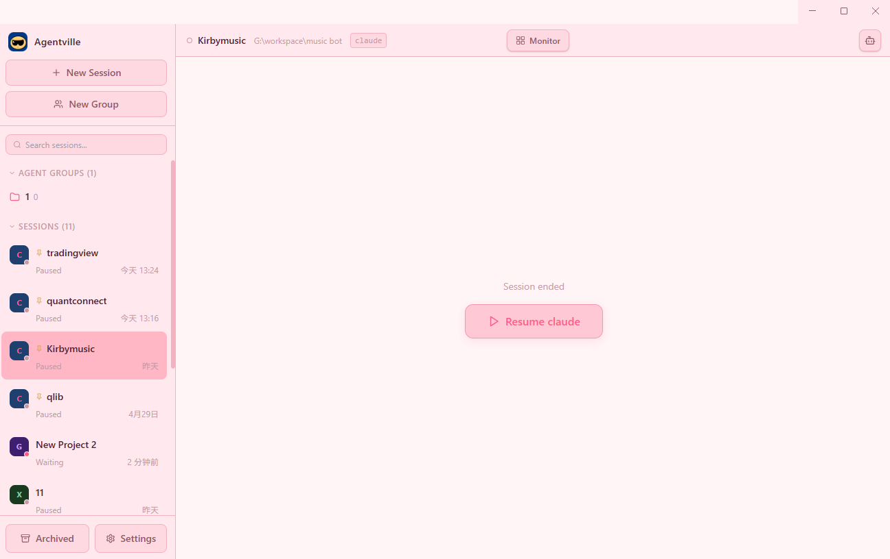 |

### MCP server presets

8 common MCP presets built in, toggled on / off:

Filesystem · Brave Search · Fetch · Playwright · Memory · SQLite · GitHub · Puppeteer

Presets that need an API key or path expand into a form automatically, with eye-toggle on password fields. On Windows, `npx` / `uvx` are auto-wrapped through `cmd.exe`. You can also add custom MCP servers manually.

---

## Getting started

### Run the dev build

```bash
git clone https://github.com/lict1212/agentville.git
cd agentville
npm install
npm run dev
```

### Package

```bash
npm run build
```

### CLI requirements

You need at least one of these installed:

- **Claude Code**: <https://docs.anthropic.com/en/docs/claude-code>
- **Codex**: `npm i -g @openai/codex`
- **Gemini CLI**: `npm i -g @google/gemini-cli`
- **Aider**: `pipx install aider-chat`

On launch, Agentville detects them via `where` / `which`; any missing CLI shows a friendly overlay with its install command.

---

## Tech stack

- **Electron 35** + **electron-vite** — separated main / renderer processes
- **React + TypeScript** — renderer layer
- **Tailwind CSS** + CSS variables — themes switched via `data-theme`
- **xterm.js** — terminal rendering, with per-project buffer replay on switch
- **node-pty** — PTY process management
- **Zustand** — state
- **electron-store** — local persistence

---

## Roadmap

- [ ] Per-session xterm instances + WebGL rendering (fully fixes render glitches on long-running sessions)
- [ ] In-group agent collaboration (shared context / output handoff)
- [ ] Monitor group-card expand animation + group colors / icons
- [ ] Automatic session naming
- [ ] Update detection (prompt when a new GitHub release is available)

---

## License

[MIT](LICENSE) © 2026 lict1212
